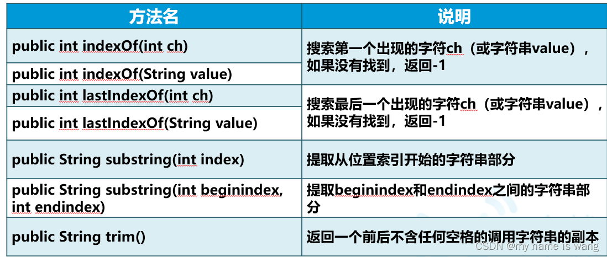

## String

### 获取功能

1）length():获取字符串的长度，其实也就是字符个数
2）charAt(int index):获取指定索引处的字符

3）indexOf(String str):获取str在字符串对象中第一次出现的索引
4）substring(int start):从start开始截取字符串
5）String substring(int start,int end):从start开始，到end结束截取字符串。包括start，不包括end

### 判断功能

1）equals(Object obj):比较字符串的内容是否相同

2）isEmpty()：判断指定字符串是否为空

3）compareTo(String anotherString)：比较字符串的大小，前者大返回整数，后者大返回负数，相等返回0

### 转换方法

1）toCharArray():把字符串转换为字符数组

2）toLowerCase():把字符串转换为小写字符串

3）toUpperCase():把字符串转换为大写字符串

### 其他方法

1）replace(char oldChar, char newChar)：将指定字符替换成另一个指定的字符

2）replaceAll(String regex,String replasement)：用新的内容替换全部旧内容

> replaceAll的参数是regex,即基于规则表达式的替换,比如,可以通过replaceAll("\\d", "*")把个字符串所有的数字字符都换成星号;

```java
String src = new String("ab43a2c43d");
System.out.println(src.replace("3","f"));=>ab4f2c4fd.
System.out.println(src.replace('3','f'));=>ab4f2c4fd.
System.out.println(src.replaceAll("\\d","f"));=>abffafcffd.
```

3）replaceFirst(String regex,String replacement)：替换首个满足条件的内容

4）contains(CharSequence s)：查看字符串中是都含有指定字符



## hashmap

```java
    1：put方法：put(key，value)，我们经常用存储一些常用的数据，比如flag、百分比之类的，我们就可以返回map结构，如果key相同则值会覆盖，允许key和value为null。
    
    2：get方法：get(key)，主要用来取map中存储的数据，我们根据其key值，可以取到对应的value值，没有该key对应的值则返回null。

    3：remove方法：remove(key)，主要用来删除map中对应的key及其value值。

    4：clear方法，用法：clear()，会清空map中的数据。

    5：containsKey(key)，判断map集合中是否包含某个key。

    6：containsKey(value)，判断map集合中是否包含某个value。
    
    7：entrySet()：hashmap.entrySet().iterator()，entrySet()的效率比keySet()要高。key和value存储在entry对象里面，遍历的时候，拿到entry对象就可以取到value了。

    8：keySet()：hashmap.keySet().iterator()，keySet是把key放到一个set集合中，通过迭代器遍历，再用hashmap.get(key)来取到value的值。
```
## TreeMap

### 构造方法

1. TreeMap()：创建一个空TreeMap，keys按照自然排序

```java
TreeMap<Integer, String> treeMap = new TreeMap<>();
```

2. TreeMap(Comparator comparator)：创建一个空TreeMap，按照指定的comparator排序

```java
TreeMap<Integer, String> map = new TreeMap<>(Comparator.reverseOrder());
map.put(3, "val");
map.put(2, "val");
map.put(1, "val");
map.put(5, "val");
map.put(4, "val");
System.out.println(map); // {5=val, 4=val, 3=val, 2=val, 1=val}
```

3. TreeMap(Map m)：由给定的map创建一个TreeMap，keys按照自然排序

```java
Map<Integer, String> map = new HashMap<>();
map.put(1, "val");
...
TreeMap<Integer, String> treeMap = new TreeMap<>(map);
```

4. TreeMap(SortedMap m)：由给定的有序map创建TreeMap，keys按照原顺序排序

### 常用方法

```java
V put(K key, V value)：将指定映射放入该TreeMap中
void clear()：清空TreeMap中的所有元素
V remove(Object key)：从TreeMap中移除指定key对应的映射
V replace(K key, V value)：替换指定key对应的value值
boolean containsKey(Object key)：判断该TreeMap中是否包含指定key的映射
boolean containsValue(Object value)：判断该TreeMap中是否包含有关指定value的映射
Set<Map<K, V>> entrySet()：返回由该TreeMap中的所有映射组成的Set对象
int size()：返回该TreepMap中包含的映射的数量
```

### 遍历方式

> for循环

```java
for (Map.Entry entry : treeMap.entrySet()) {
      System.out.println(entry);
}
```

> 迭代器循环

```java
Iterator iterator = treeMap.entrySet().iterator();
while (iterator.hasNext()) {
      System.out.println(iterator.next());
}
```

### 自定义比较器

```java
Map<Integer, Object> map = new TreeMap<>(new Comparator<Integer>() {
    @Override
    public int compare(Integer o1, Integer o2) {
        return o2 - o1;
    }
});
map.put(5, new Object());
map.put(10, new Object());
map.put(8, new Object());
map.put(12, new Object());
System.out.println(map);
```


## ArrayList

### 1、add(Object element) 方法

add(Object element) 方法用于向ArrayList集合中的添加元素。

### 2、size() 方法

size()方法用于返回ArrayList集合中元素个数

### 3、get(int  index)  方法

get(int index)方法用于返回集合中对应位置的元素

### 4、add(int index, Object element) 方法

add(int index, Object element) 方法用于在集合指定位置添加元素，原集合中从指定位置开始的元素全部后置

### 5、set(int i, Object element) 方法

set(int i, Object element) 方法用于将索引i位置元素替换为元素element并返回被替换的元素

### 6、clear() 方法

clear() 方法用于清空集合中元素

### 7、isEmpty() 方法

isEmpty() 方法用于判断集合容器是否为空，如果为空，则返回true，否则返回false。 

### 8、iterator() 

iterator（）不是一个方法而是一个用于返回按适当顺序在列表的元素上进行迭代的迭代器可以用它遍历集合元素

### 9、contains(Object o) 方法

contains(Object o) 方法用以判断集合容器中是否含有指定元素，有返回值，且为boolean型。

### 10、remove(int index) 方法

remove（int index）方法用于移除列表中指定位置的元素，并返回被删元素

### 11、remove(Object o) 方法

remove(Object o) 方法用于移除集合中第一次出现的指定元素，移除成功返回true，否则返回false。

### 转字符串数组

```java
方法一、
String[] arr = new String[list.size]; 
list.toArray(arr);//此时arr就有了list中的值了`

方法二、
String[] arr = (String[])list.toArray(new String[0]);`

```

### 构造方法

```java
List<String> list3 = new ArrayList<>(list2);
List<String> list1 = new ArrayList<>();
//构造一个具有指定初始容量的空列表。
List<String> list2 = new ArrayList<>(6);

```

## StringBuffer

### StringBuffer对象的初始化

```java
StringBuffer s = new StringBuffer();
StringBuffer s = new StringBuffer(“abc”);

```

### StringBuffer对象和String对象之间的互转

```java
String s = “abc”;
StringBuffer sb1 = new StringBuffer(“123”);
StringBuffer sb2 = new StringBuffer(s); //String转换为StringBuffer
String s1 = sb1.toString(); //StringBuffer转换为String
```

### 常用方法

#### 1、append方法

```java
StringBuffer sb = new StringBuffer();
String user = “test”;
String pwd = “123”;
sb.append(“select * from userInfo where username=“)
.append(user)
.append(“ and pwd=”)
.append(pwd);
```

这样对象sb的值就是字符串“select * from userInfo where username=test and pwd=123”

#### 2、deleteCharAt方法

该方法的作用是删除指定位置的字符，然后将剩余的内容形成新的字

```java
StringBuffer sb = new StringBuffer(“Test”);
sb. deleteCharAt(1);
```

该代码的作用删除字符串对象sb中索引值为1的字符，也就是删除第二个字符，剩余的内容组成一个新的字符串。所以对象sb的值变为”Tst”

#### 3、delete方法

```java
public StringBuffer delete(int start,int end)
StringBuffer sb = new StringBuffer(“TestString”);
sb. delete (1,4);
```

#### 4、insert方法

```java
public StringBuffer insert(int offset, boolean b)

StringBuffer sb = new StringBuffer(“TestString”);
sb.insert(4,false);

```

该示例代码的作用是在对象sb的索引值4的位置插入false值，形成新的字符串，则执行以后对象sb的值是”TestfalseString”

